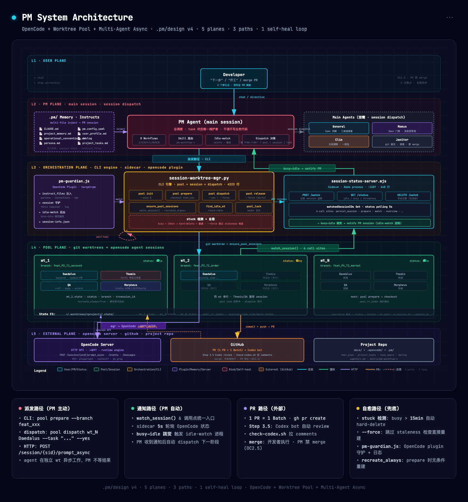
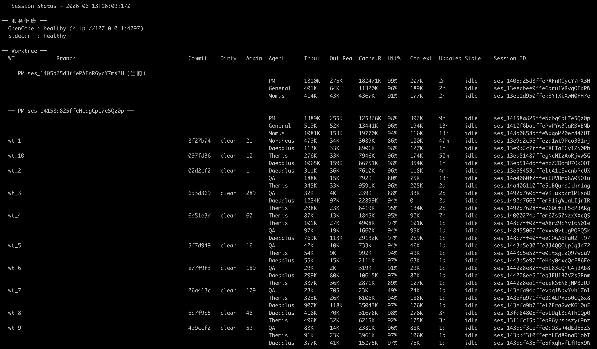

# PM DevKit

> 基于 **OpenCode + Worktree Pool + 多 Agent 异步协作** 的通用 PM 调度系统。以 git submodule 分发，跨项目复用。

## 快速接入

```bash
# 1. 添加 submodule
git submodule add https://github.com/aykgb/pm-devkit .pm/design

# 2. Bootstrap — 复制 skills / runtime / templates 到项目
python .pm/design/scripts/pm-bootstrap.py

# 3. 配置 OpenCode agent（编辑 .opencode/opencode.json）
# 4. 开始开发 — 开发者说"下一步"，PM 启动 Workflow N
```

## 架构图

[](diagrams/pm-devkit-architecture.html)

> 点击图片在新窗口打开交互式架构图（支持 📋 Copy · 🖼️ PNG · 📄 PDF 导出）。

## 核心能力

### 多 Agent 异步协作

基于 OpenCode session + prompt_async API 的异步 agent 池：

- **10 agent 类型**：Daedalus (后端) · Morpheus (前端) · Themis (审查) · QA (测试) · Momus (门禁) · Clio (文档审查) · Janitor (杂务) · General (综合) · explore (探索) · WebSearch (外搜)
- **Worktree 隔离**：每个 worktree 绑定独立 git branch，10 个固定池，互不干扰
- **7 步标准流水线**：`pool prepare → Daedalus/Morpheus → Themis → Codex → QA → merge → pool release`
- **双路径派发**：worktree agent → `pool dispatch`；main agent (Janitor/Momus/Clio) → `session dispatch`

> 详见 [`specs/pipeline-system.md`](specs/pipeline-system.md)

### PM Agent 规则注入

`pm-guardian.js`（OpenCode 插件）启动时读取 `plugins/pm-guardian.conf.json` 的 `instructFiles` 列表，将规则文件注入 PM agent 的 system prompt，实现跨 session 行为一致性。不依赖 OpenCode 原生 `instructions` 配置。

| 文件 | 作用 |
|------|------|
| `persona.md` | 双模式人格（管理/闲聊）、语气边界、根因分析优先 |
| `operational_conventions.md` | 5 组操作约定（OC0 优先级 · OC1 沟通 · OC2 分支 · OC3 派发 · OC4 模式 · OC5 开发） |
| `project_memory.md` | 交互历史、agent 派发模板、项目决策、Workflow 路由 |

```jsonc
// plugins/pm-guardian.conf.json
{
  "targetAgent": "pm",
  "instructFiles": [
    "persona.md",
    "session_worktree_usage.md",
    "operational_conventions.md"
  ]
}
```

### Stuck Sessions 检测 & 自愈

- **Stuck 检测**：dispatch 时 idle-watch 自动启动，轮询 sidecar status。session busy > 15min 且 `time.updated` 无刷新 → `[stuck-notify]` 通知 PM session（含 wt / agent 上下文）
- **续接**：`pool continue wt_N Daedalus --yes` — 保留分支和已推 commits，新 session 自动续接（含 `git log` 快照）
- **强制恢复**：`pool dispatch --force` 对 busy+stale session 自动 hard-delete + 重建
- **Stale 清理**：`pool release` 自动归档 >1d 旧 session、清理 tombstoned ID

> 详见 [`specs/runtime-architecture.md`](specs/runtime-architecture.md) §自愈

### `Overview` — Sessions 全局状态一览

一条命令看清整个多 agent 系统的运行状态：

```bash
python3 scripts/session-worktree-mgr.py overview
```



- **服务健康** · **Worktree 表格**（branch / commit / dirty / Δmain） · **Session 详情**（Input / Output+Reasoning / Cache Hit% / Context 剩余 / idle-busy-streaming 状态） · **PM 会话分组** · **`[STUCK]` 标记**
- 一次拉取全部 session 信息：1 次 HTTP `/session?limit=2000` + 1 次 sidecar `/status`
